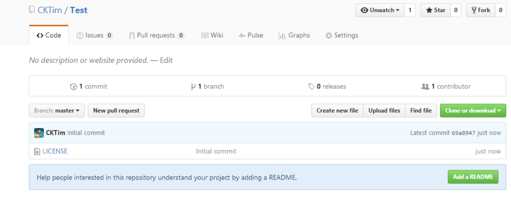
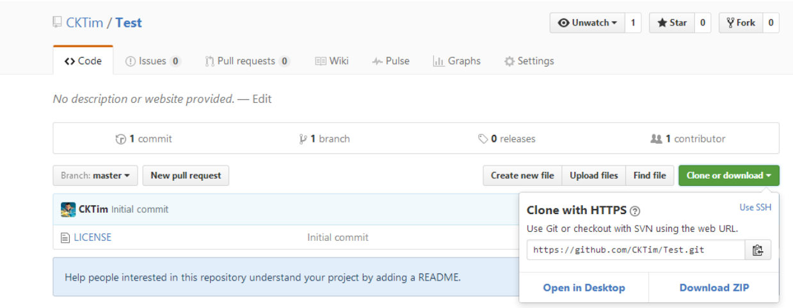
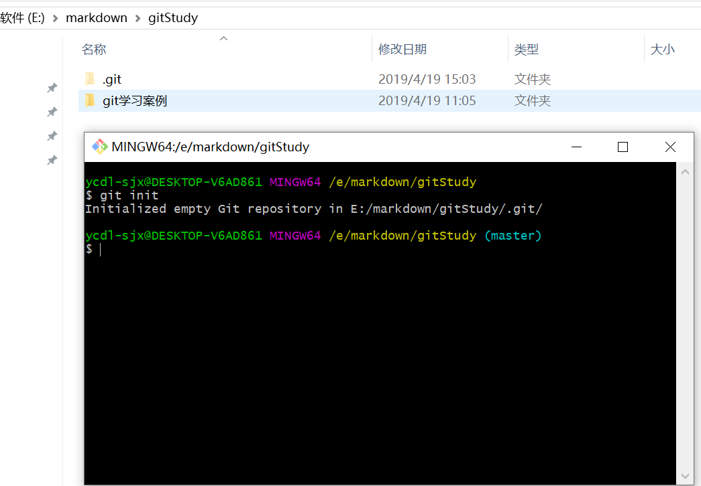

# 怎么使用Git上传我们的代码呢？
## 一、首先你需要一个github账号，所有还没有的话先去注册吧！
网址：https://github.com/
注意：注册完成后，把用户名、email、密码用记事本保存起来，以免以后忘记。
## 二、在GitHub创建git仓库
** 1.进入Github首页，点击New repository新建一个项目 **

** 2.填写相应信息后点击create即可 **
Repository name: 仓库名称
Description(可选): 仓库描述介绍
Public, Private : 仓库权限（公开共享，私有或指定合作者）
Initialize this repository with a README: 添加一个README.md
gitignore: 不需要进行版本管理的仓库类型，对应生成文件.gitignore
license: 证书类型，对应生成文件LICENSE

** 3.已成功创建仓库 **

** 4.点击Clone or dowload会出现一个地址，copy这个地址备用。**

## 三、接下来就到本地操作了,在本地安装git客户端
下载windows操作系统的git客户端网址：https://gitforwindows.org/
安装git客户端可参考教程：https://jingyan.baidu.com/article/8cdccae90beafa315413cd13.html
## 建立本地版本库

