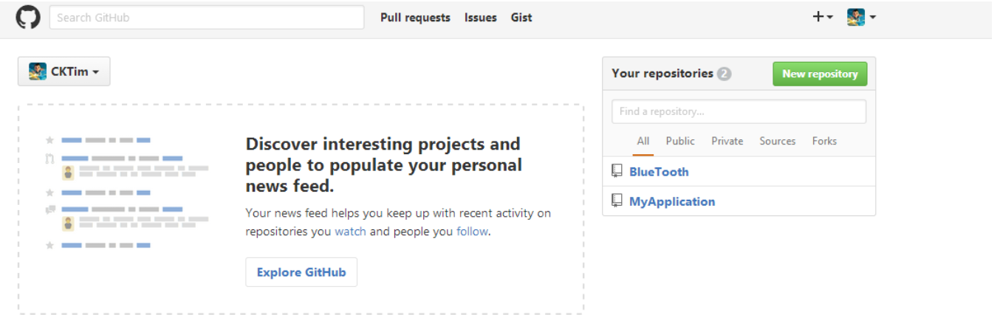
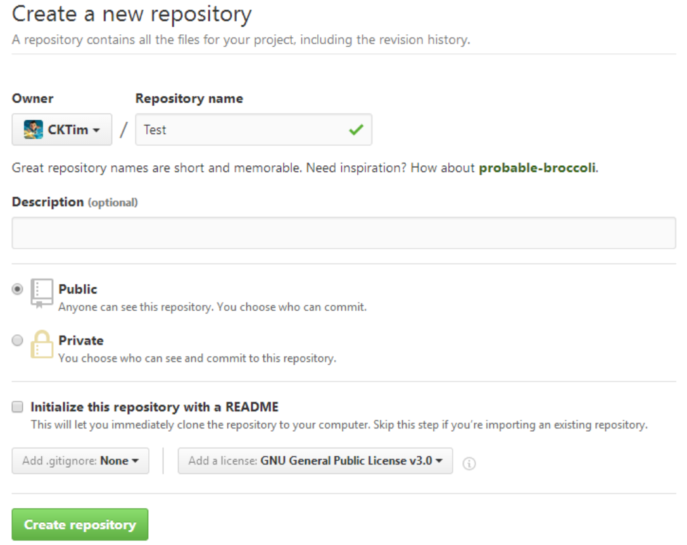
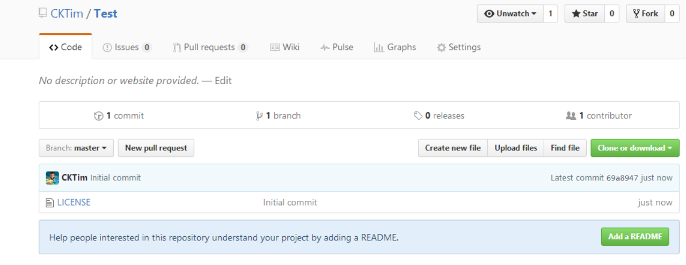
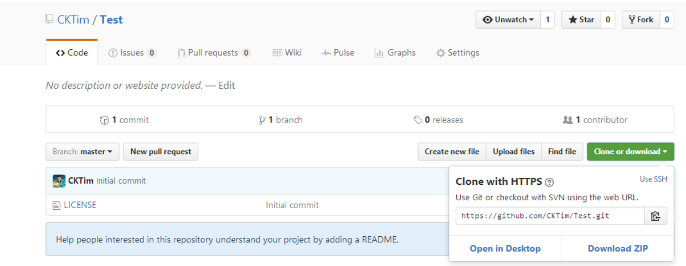
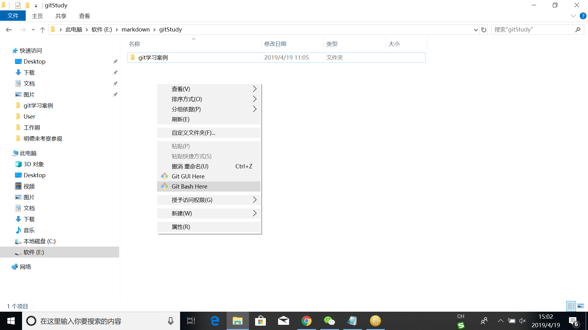
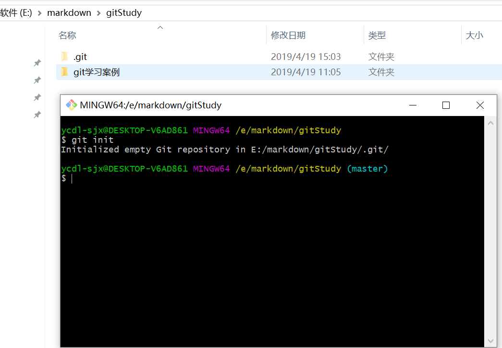
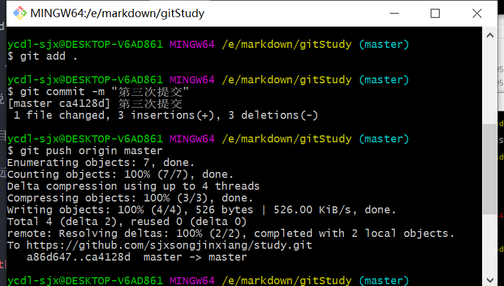

# 怎么使用Git上传我们的代码呢？
## 一、首先你需要一个github账号，所有还没有的话先去注册吧！
网址：https://github.com/
注意：注册完成后，把用户名、email、密码用记事本保存起来，以免以后忘记。
## 二、在GitHub创建git仓库
** 1.进入Github首页，点击New repository新建一个项目 **

** 2.填写相应信息后点击create即可 **
* Repository name: 仓库名称
* Description(可选): 仓库描述介绍
* Public, Private : 仓库权限（公开共享，私有或指定合作者）
* Initialize this repository with a README: 添加一个README.md
* gitignore: 不需要进行版本管理的仓库类型，对应生成文件.gitignore
* license: 证书类型，对应生成文件LICENSE

** 3.已成功创建仓库 **

** 4.点击Clone or download会出现一个地址，copy这个地址备用。**

## 三、接下来就到本地操作了,在本地安装git客户端
下载windows操作系统的git客户端网址：https://gitforwindows.org/
安装git客户端可参考教程：https://jingyan.baidu.com/article/8cdccae90beafa315413cd13.html
### 1.建立本地版本库
在本地硬盘上新建目录E:\markdown\gitStudy，路径中不允许出现中文。
接下来就到本地操作了，首先右键你的项目，如果你之前安装git成功的话，右键会出现两个新选项，分别为Git Gui Here,Git Bash Here,这里我们选择Git Bash Here，进入如下界面，gitStudy即为我的项目名。

### 2.现在来学习一下操作的命令
* git remote add origin https://github.com/sjxsongjinxiang/study.git   【说明：将本地的仓库关联到github上 其中“https://github.com/sjxsongjinxiang/study.git”是git仓库地址】
* $ git add 文件名称   【说明：用命令git add 告诉Git，把文件添加到仓库中】
* $ git add .        【说明：用命令git add .告诉Git，把本目录下所有文件添加到仓库】
* $ git commit -m "对于本次提交的说明"  【说明：对于本次提交的说明】
* $ git push origin master  【说明：此操作目的是把本地仓库push到github上面，此步骤需要你输入帐号和密码】
* $ git pull origin master  【说明：表示将远程origin主机的master分支拉取过来和本地的当前分支进行合并。】
### 3.知道了命令，现在操作起来吧
#### (1)初始化本地库

#### (2)接下来输入如下代码（关键步骤），把github上面的仓库克隆到本地。
git clone https://github.com/sjxsongjinxiang/study.git ，其中（https://github.com/sjxsongjinxiang/study.git 替换成你之前复制的地址）
### (3)上传代码
$ git add .  【说明：上传整个目录的文件】
$ git commit -m "第三次提交"  【说明：对于本次提交的说明】
$ git push origin master 【说明：把本地仓库push到github上面】

